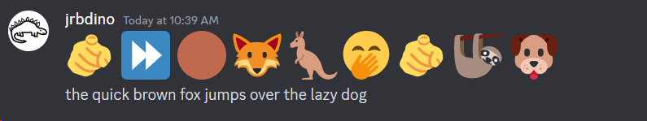

# Second Sprint
#### ***03/29/24 - 04/01/24***

### Sprint Summary:
This sprint involves the introduction of bot messages. There is testing to check the functionality of using Discord emoji strings passed within messages from the .py script the bot is running off of. Additionally, we will find a dictionary of words and their corresponding emojis to begin testing with. Further in the process, there will be a more complete dictionary including refined definitions and suplementary phrases.

### Outcomes Required to Finish the Sprint:
  - prototype #2 
  - send test message with discord formatted emojis
  - test dictionary of words to replace with emojis
